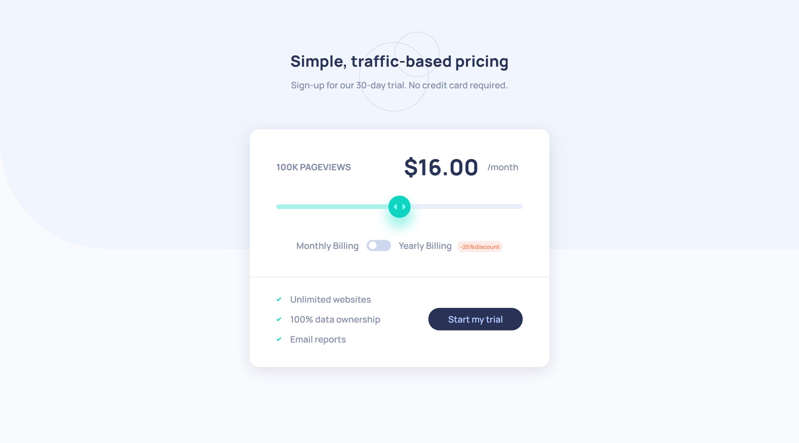
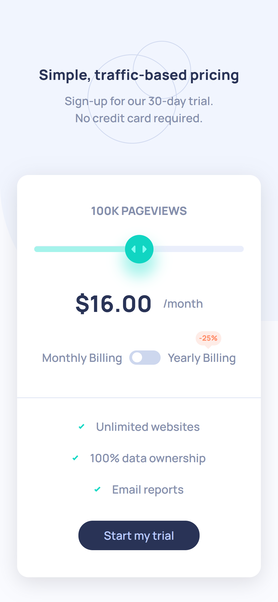

# Frontend Mentor - Interactive pricing component solution

This is a solution to the [Interactive pricing component challenge on Frontend Mentor](https://www.frontendmentor.io/challenges/interactive-pricing-component-t0m8PIyY8). Frontend Mentor challenges help you improve your coding skills by building realistic projects. 

## Table of contents

- [Overview](#overview)
  - [The challenge](#the-challenge)
  - [Screenshot](#screenshot)
  - [Links](#links)
- [My process](#my-process)
  - [Built with](#built-with)
  - [What I learned](#what-i-learned)
  - [Continued development](#continued-development)
  - [Useful resources](#useful-resources)
- [Author](#author)

## Overview

### The challenge

Users should be able to:

- View the optimal layout for the app depending on their device's screen size
- See hover states for all interactive elements on the page
- Use the slider and toggle to see prices for different page view numbers

### Screenshot

### Links

- Solution URL: (https://github.com/arbaiv/interactive-pricing-component-challenge)
- Live Site URL: ()

## My process

### Built with

- Semantic HTML5 markup
- CSS custom properties
- Flexbox
- CSS Grid
- Mobile-first workflow
- JavaScript

### What I learned

- Create custom range slider
- Make range slider accessible
- Create custom css toggle button and animation to it

### Continued development

I have to build more interactive components using vanilla JS to improve my js skills and also have to learn more about making different components accessible. 

### Useful resources

- [Resource 1](https://css-tricks.com/styling-cross-browser-compatible-range-inputs-css/) - This helped me to create a custom range slider.
- [Resource 2](https://developer.mozilla.org/en-US/docs/Web/Accessibility/ARIA/Roles/slider_role) - Learned how to make custom range slider accessible for everyone
- [Resource 3](https://www.youtube.com/watch?v=N8BZvfRD_eU&ab_channel=WebDevSimplified) - Learned how to create custom css toggle button and add animation to it.
- [Resource 4](https://stackoverflow.com/questions/18083061/make-element-unclickable-click-things-behind-it) - This answer helped me to make an element unclickable but made the elements behind it clickable.
- [Resource 5](https://stackoverflow.com/questions/40871127/can-i-use-css-calc-within-javascript#:~:text=Yes%2C%20calc()%20will%20work%20when%20setting%20styles%20in%20javascript.) - Learned how to use css calc variable in js.
- [Resource 6](https://developer.mozilla.org/en-US/docs/Web/CSS/:focus-visible) - Learned how to add design to elements that were focused using keyboard

## Author

- LinkedIn - [Abdur Rahaman](https://www.linkedin.com/in/abdur-rahaman-arb4/)
- Github - [@arbaiv](https://github.com/arbaiv)
- Twitter - [@arbaiv](https://twitter.com/arbaiv)
- Frontend Mentor - [@arbaiv](https://www.frontendmentor.io/profile/arbaiv)